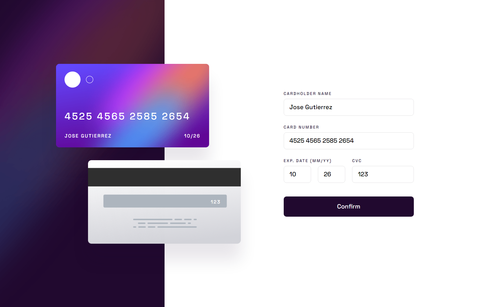

# Frontend Mentor - Interactive card details form solution

This is a solution to the [Interactive card details form challenge on Frontend Mentor](https://www.frontendmentor.io/challenges/interactive-card-details-form-XpS8cKZDWw). Frontend Mentor challenges help you improve your coding skills by building realistic projects. 

## Table of contents

- [The challenge](#the-challenge)
- [Screenshot](#screenshot)
- [Links](#links)
- [My process](#my-process)
- [Useful resources](#useful-resources)
- [Author](#author)

## The challenge

Users should be able to:

- Fill in the form and see the card details update in real-time
- Receive error messages when the form is submitted if:
  - Any input field is empty
  - The card number, expiry date, or CVC fields are in the wrong format
- View the optimal layout depending on their device's screen size
- See hover, active, and focus states for interactive elements on the page

## Screenshot



## Links

- Solution URL: [GitHub Repository](https://github.com/joangute/interactive-card-form/)
- Live Site URL: [GitHub Pages](https://joangute.github.io/interactive-card-form/)

## My process

Working with many things in mind( positioning, sizing, a lot of validations) can be overwhelming for newbies. I ended up with a lot of spaghetti code which I had to deal with later. Thus in this repository is the cleanest code I can generate for the moment.

My two main challenges where: to find a hidden `p` tag that had to appear along with to the other error message `p` tags. I checked html wrapping, the javascript code, then css and nothing. This `p` had an explicit `display:block` but it wasn't there. The solution was "Specificity", this `p` had a different selector for `display:none`, I initialized all the `p` next to a sibling `input` as `display:none`, but this `p` tag was not sibling of any `input` and I had to use another selector that gave it more specificity; so when I added a class with `display:block` to all the `p`, this class had less specificity and did not affect that hidden `p`.

My second challenge was more interesting, I had to get the code key for "backspace" in my `input` event in javascript for ignore some code in my card number html input field. I entered to stackoverflow and almost everyone told me to use `keydown` , `keyup` or `keypress` event to use an `if(event.key=='Backspace')`, the problem was `keydown` did not catch the first key, so the first number of my credit card did not catch any event, then I tried `keyup` and it was weird because the event did not show me in real time any change on screen, later I used `keypress` and this did not work when I key down. Finally I found the answer I was looking for:

```js
  if(event.inputType=='deleteContentBackward')
```

The `input` event had this `inputType` property, so I did not have to use the other events that working weird in my app.

## Useful resources

- [RegExr](https://regexr.com/) - Here you can build and test your regular expressions.
- [Percentage Calculator](https://www.calcularporcentajeonline.com/) - I use this to calculate spacing.
- [Specificity](https://developer.mozilla.org/es/docs/Web/CSS/Specificity) - Here you can learn about specificity in css selectors.
- [Stackoverflow](https://stackoverflow.com/) - Here you can obtain answers to doubts related to code.

## Author

- Frontend Mentor - [@joangute](https://www.frontendmentor.io/profile/joangute)